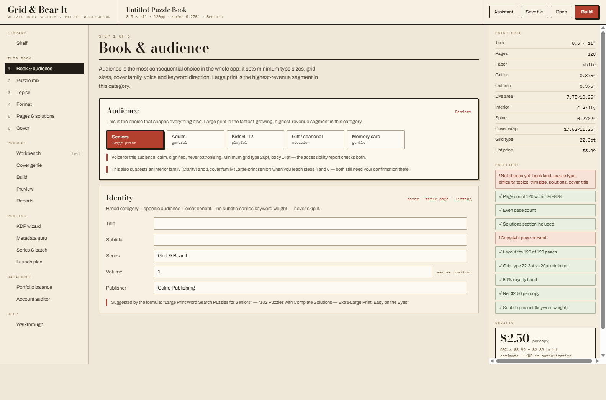

# Grid &amp; Bear It — Puzzle Book Studio

A desktop-class puzzle and activity book generator that produces print-ready
interiors, covers and Amazon KDP listing metadata. Built as one self-contained
HTML file: no install, no server, no internet required.

Published under **Califo Publishing**; *Grid &amp; Bear It* is the puzzle-book imprint.



**[▶ Live demo](https://YOUR-USERNAME.github.io/grid-and-bear-it/)** ·
[Download the app](Grid%20and%20Bear%20It%20Studio%20%28offline%20app%29.html) ·
[Developer handoff](HANDOFF.md) ·
[Start here](START-HERE.md)

---

## The problem

Self-published puzzle books are a real market, and most of them are bad in
predictable ways: puzzles with more than one solution, answer keys that do not
match the puzzle numbers, grids too small for the audience on the cover, text
lost in the binding gutter, and metadata that nobody searches for. Each of those
is a review-killer, and each is a solvable engineering problem.

This app solves them at generation time rather than proof-reading time.

## What it does

**Generates 21 puzzle types** with a known solution for every single one:

| Family | Types |
| --- | --- |
| Word | word search · crossword · fill-in · cryptogram · word scramble · anagram match · word ladder |
| Number | sudoku 9×9 / 6×6 / 12×12 · X-sudoku · jigsaw sudoku · KenKen · kakuro · math drills |
| Logic | nonogram · logic grid |
| Activity | maze · trivia · dot-to-dot · coloring pattern |

**Proves uniqueness where ambiguity is possible.** Sudoku (all variants), KenKen,
kakuro and nonograms are run through a real solver that counts solutions and
discards any puzzle with more than one. The rest are unique by construction.
Nothing unsolvable or ambiguous can reach a page.

**Lays out a print-ready book.** Trim size, paper thickness and page count drive
KDP's actual paperback geometry — gutter width bands, outside margins, spine
width, full cover wrap dimensions, spine-text eligibility. Recto and verso pages
mirror their margins correctly.

**Six interior design families and seven cover families**, spanning kid-playful
to formal gift edition, each tied to an audience profile that enforces minimum
grid and body type sizes.

**Optimises the listing.** Title formula, seven keyword phrases built from search
language rather than internal identifiers, category paths, a price ladder showing
net royalty at each list price, and the full description ready to paste.

**Audits the catalogue.** Portfolio balance measures concentration across
audience, puzzle family, interior look, cover family, trim and difficulty, and
names the shelf positions never published into. The account auditor ingests
pasted KDP reports and separates *nobody sees it* from *people see it and don't buy*.

**Optional AI.** A brief-driven assistant proposes designs, topics, clues, titles,
blurbs, keywords and series plans. It never generates puzzles — those stay local
and verified. Without a connection every other feature works normally.

## Running it

Open `Grid and Bear It Studio (offline app).html` in any modern browser. That is
the whole installation. Fonts are embedded, storage is local, and nothing phones
home.

For development, open `Grid & Bear It Studio.dc.html` with the sibling `.js`
modules present.

## Architecture

```
Grid & Bear It Studio.dc.html    UI, page-layout engine, exports, ~2600 lines
├── puzzle-engine.js             sudoku, word search, crossword, cryptogram,
│                                scramble, math, maze, KenKen + 30 topic libraries
├── puzzle-engine-extra.js       sudoku variants, kakuro, nonogram, logic grid,
│                                word ladder, anagram, fill-in, trivia, dot-to-dot
├── kdp-guru.js                  KDP geometry, print costs, royalty bands,
│                                audience profiles, cover families, keyword
│                                generation, calibration, accessibility
└── engines.bundle.js            GENERATED — classic-script build of the above
```

The three engine modules are pure ES modules with **no DOM access and no
dependencies**. Every generator is deterministic given its inputs and directly
reusable in Node, a worker, or a rewrite in any framework. All domain knowledge —
KDP's margin bands, paper thicknesses, royalty rates, category trees — lives in
`kdp-guru.js` rather than being scattered through the UI.

Key design decisions and their reasoning are in [HANDOFF.md](HANDOFF.md).

### Verification approach

Puzzle correctness is enforced by construction plus a solution counter, not by
tests over fixtures:

- `makeSolver(n, regions, diagonals)` generalises sudoku to any size, any region
  map, optional diagonal constraint — one solver serves five variants.
- `kakuroSolutions` and `nonogramSolutions` do constraint-propagating searches
  with early pruning, capped so generation stays interactive.
- `calibrate(puzzle)` scores difficulty from measurable structure (givens ratio,
  cage count, run count, word load with direction penalties, path length), so the
  Reports view can show whether the difficulty curve actually climbs rather than
  trusting the label.

## Honest limitations

- **No KDP upload.** Amazon exposes no publishing API. The app produces
  upload-ready files; the upload is manual.
- **No sales or traffic API.** Amazon exposes none. The auditor reads reports you
  paste.
- **PDF export goes through the browser print dialogue.** Correct page boxes,
  but one manual step. A real PDF engine is the top backlog item.
- **Difficulty is structural, not human solve-time.** A 28-given sudoku is
  genuinely harder than a 46-given one, but "expert" does not certify that
  advanced solving techniques are required.
- **Crosswords are criss-cross style**, not symmetric NYT-style grids, and the
  built-in clue dictionary is small; unusual words fall back to length clues.
- **Illustration frames are placeholders.** You supply 300 dpi art.

## Roadmap

1. Generation in a Web Worker — sudoku verification currently blocks the main thread
2. Real PDF generation (pdf-lib) to remove the print-dialogue step
3. Drag-and-drop image slots with 300 dpi validation
4. Puzzle-level hashing to dedupe grids across an entire series
5. Expanded crossword clue dictionary
6. Tauri wrapper for a signed desktop installer

## Licence

MIT — see [LICENSE](LICENSE).
